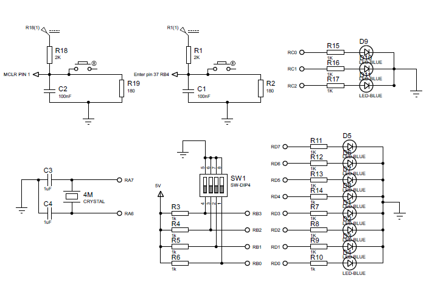

Descripcion de funcionamiento:
La idea central es implementar una calculadora binaria, donde los valores de los operandos y el selector se manejan a través de los pines del puerto PORTB conectados a un interruptor físico (switch).

PinOut: 
Montaje: 
Entradas Binarias:

Los pines RB0, RB1, RB2 y RB3 se usan para ingresar números binarios de 4 bits, tanto para los operandos como para la operación a realizar.

Estos valores se leen por separado como OPERANDO_1, OPERANDO_2 y selector.

Función de RB4:

El pin RB4 funciona como un botón que actúa como "Enter" para confirmar y almacenar el valor ingresado. Cada vez que se presiona, el código lo detecta con la función FUNCION_ENTER, garantizando la estabilidad del ingreso con retardos (__delay_ms).

Selector de Operación:

El valor leído en el selector (PORTB & 0b00001111) determina qué operación matemática se llevará a cabo. Estas operaciones están asignadas a cada caso dentro de un switch en la función LEER_OPERACION. Las opciones incluyen suma, resta, operaciones lógicas (AND, OR), multiplicación y división.

Resultados:

Los valores de los operandos y el resultado de la operación se muestran a través de LEDs controlados por los puertos LATC y LATD. Esto permite visualizar el proceso de cálculo binario y el resultado final.

Ciclo Principal:

Después de configurar los puertos y hacer una verificación visual (indicador de vida con LEDs), el programa ejecuta la rutina (RUTINA), que orquesta todo: lectura de datos, selección de operación y despliegue del resultado.
